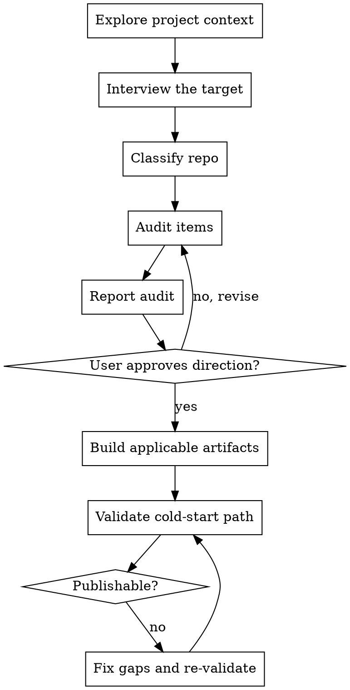

# Make Publishable

Turn a project into one that a new engineer or agent can understand, set up, validate, and release without tribal knowledge.

Start by understanding the repo and its consumer, then run a strict publishability workflow: classify the project, audit what exists, fill only the gaps that matter, and validate the result from a cold start.

Do NOT create or update docs, CI, release automation, install scripts, or agent guidance until you have classified the repo, completed the audit, reported every audit item as Keep, Update, Create, or Skip, and shown that audit direction to the user.

## Anti-Pattern: "Every Repo Needs the Same Release Kit"

Publishable does not mean "README + CONTRIBUTING + GitHub Actions + Distribution for every repo." A library, service, SDK, CLI, and internal tool have different consumers, different first actions, and different release stories.

## Checklist

You MUST create a task for each of these items and complete them in order:

1. **Explore project context** — read the manifest, entry points, docs, and release story before asking anything
2. **Interview the target** — identify the consumer, project type, distribution channel, automation host, and repo shape
3. **Run the audit** — classify each publishability item as Keep, Update, Create, or Skip
4. **Report the audit** — show the user the audit and justify every Skip before editing
5. **Build only what applies** — update metadata, docs, automation, and safety artifacts in the right order
6. **Validate the consumer path** — follow the real cold-start path for the project type
7. **Stop if the path fails** — if the documented path does not work, the repo is not publishable yet

Use your create-todo tool or similar to make this todo list.

## Process Flow



## The Process

**Exploring project context:**

- Read the manifest, entry points, existing docs, and release/deploy setup first.
- Do not guess whether the repo is a CLI, library, SDK, service, internal tool, or a mixed monorepo.
- If the repo has multiple subprojects, identify which one is actually in scope before proposing docs or CI changes.

**Classifying the repo:**

Classify across these four axes before you change anything:

| Axis                 | Options                                                                                                  | What it changes                                          |
| -------------------- | -------------------------------------------------------------------------------------------------------- | -------------------------------------------------------- |
| Project type         | CLI, library, SDK, service, internal tool                                                                | README shape, install/integration story, validation path |
| Distribution channel | direct download, package registry, container registry, internal artifact store, no external distribution | release assets vs package publish vs deploy docs         |
| Automation host      | GitHub Actions, other CI/CD, no CI yet                                                                   | whether you implement or port automation invariants      |
| Repo shape           | single package, monorepo, mixed repo                                                                     | where metadata, versioning, and release checks belong    |

Use these routing hints:

- If the first consumer action is "download the binary" or `brew install`, treat it as CLI/binary-first.
- If the first consumer action is `npm install`, `pip install`, or adding a dependency, treat it as library/SDK-first.
- If the first consumer action is `docker compose up`, `make dev`, or deploy, treat it as service-first.
- If the repo serves multiple roles, optimize the top-level docs for the most common consumer and link to the rest.

If classification is still unclear after reading the repo, stop and ask the user. Do not guess.

**Interviewing the target:**

Ask enough to establish:

1. Is this public, company-internal, or team-internal?
2. What problem does it solve?
3. Who is the primary consumer: end user, developer, operator, or agent?
4. How is it meant to be distributed?
5. What counts as a successful cold start for that consumer?

**Running the audit:**

Copy this checklist and classify each item:

```text
Audit:
- [ ] Package manifest / module metadata
- [ ] README.md
- [ ] CONTRIBUTING.md
- [ ] .gitignore
- [ ] CI / quality gate
- [ ] Release / publish automation
- [ ] Install or integration path
- [ ] Configuration / authentication docs
- [ ] Versioning policy
- [ ] License / ownership / support
- [ ] Security / disclosure path
- [ ] Agent usage guidance
```

For each item, decide one of:

- **Keep** — exists and matches reality
- **Update** — exists but drifted or is incomplete
- **Create** — missing and needed
- **Skip** — does not apply to this repo

Audit rules:

- Every `Skip` needs a concrete reason.
- Good `Skip`: "No install script: this is a library published through npm."
- Bad `Skip`: "Probably not needed."
- If you cannot explain why an item is skipped, it is not a real skip yet.

Use this audit detail when judging gaps:

- **Metadata:** name, description, repository, runtime/toolchain requirements, version source, license when applicable
- **README:** one-line description, explicit scope, correct quick start, link to contributor workflow
- **CONTRIBUTING:** setup prerequisites, deterministic local workflow, exact pre-merge checks, versioning expectations
- **CI / automation:** local checks match CI, release or deploy path matches the actual distribution channel
- **Install / integration:** install script only for downloadable binaries; package-manager docs for libraries/SDKs; run/deploy docs for services
- **Config / auth:** required env vars, defaults, secret sources, safe local values
- **Security / ownership:** disclosure path or internal equivalent, support path, owning team or public contribution route
- **License**: Only for truly public projects
- **Agent guidance**: Always treat AI agents as a first-class consumer, after humans

If you believe that there are no gaps, ask yourself:

> If a new consumer followed the docs that exist today, would they successfully start using, integrating, running, or releasing this project?

If the answer is "not confidently," there are gaps and you must continue the audit.

**Reporting the audit:**

Show the user the Keep / Update / Create / Skip matrix before editing. This is the moment where you avoid writing the wrong docs for the wrong consumer.

**Building what applies:**

Work top-down in this order:

1. **Manifest / metadata** — make sure the package or module metadata tells the same story as the docs
2. **README** — shape it around the real consumer's first action
3. **CONTRIBUTING** — make contributor setup and validation deterministic
4. **Automation** — implement or update CI/release/deploy logic to match the actual distribution path
5. **Operational and support artifacts** — close gaps in versioning, ownership, security, support, and ignore rules
6. **Install script** — only for downloadable binaries, never by default
7. **Bundled agent skill** — optional, only when agents are real consumers and need decision guidance

## Documentation Rules

**README:**

- Start with one sentence that says what the project is, who it is for, and what kind of project it is.
- State what is in scope and what is out of scope.
- Put the correct first action near the top:
  - CLI/binary: install or download
  - library/SDK: add the dependency and show a minimal example
  - service: run locally, configure dependencies, and explain deploy/release shape
  - internal tool: explain access, ownership, and what is safe to run
- Include build/develop guidance and point to `CONTRIBUTING.md`.
- Document config/auth in a table once it stops fitting in one sentence.

**CONTRIBUTING:**

- State explicitly that the guide is for humans and AI agents if both are expected to contribute.
- Show exact local checks that must pass before merge.
- Keep the core quality gate short and copy-pasteable: `fmt`, `lint`, `test` or whatever the project uses.
- Make CI and local verification match.

## Automation Rules

Preserve the invariant, not the host-specific syntax:

- One visible quality gate
- CI and local verification match
- Version is verified before publish or deploy
- Build what users actually consume: binaries, packages, images, or generated SDK artifacts
- Integrity checks such as checksums or signatures belong on downloadable artifacts
- Release and deploy jobs run from immutable source such as tags, release refs, or pinned SHAs

Choose the release shape that matches the repo:

- **Downloadable binary/archive:** build release artifacts, verify version, publish assets, add checksums if users download archives directly
- **Library or SDK publish:** build the package artifact, verify version, publish from immutable source with minimum required credentials
- **Service deploy:** build the deploy artifact, tag it correctly, deploy only from validated output

Do not force GitHub Releases onto projects that actually publish to a package registry or container platform.

A project might not need any release automation at all. If none is present, ask the user if they want to add it. If not, leave it as is.

## Install Script Rules

Install scripts are only for downloadable CLI or binary projects.

Use an install script only when all of these are true:

- the project ships a user-invoked executable
- the primary consumer downloads release artifacts instead of adding a dependency
- the script improves the install path instead of hiding it
- the release channel has a stable way to fetch versioned artifacts

Never add an install script:

- to a library or SDK whose correct path is a package manager
- to a service that should be deployed, not installed locally
- just because "publishable repos should have one"

If you do add one, keep these non-negotiables:

- verify integrity before extraction
- install under the user's home directory, not system paths
- make transport and auth explicit
- fail clearly on unsupported platforms
- keep the script aligned with the actual release artifact names and version policy

## Guarantees to Enforce

- **Scope is explicit.** Consumers know what the project does and does not do.
- **The consumer path is documented.** A new user knows the right first action.
- **The contributor path is deterministic.** Local checks are visible and reproducible.
- **Configuration and authentication are discoverable.** No tribal knowledge for env vars or credentials.
- **Versioning is documented.** Contributors know what requires a bump or release note.
- **Ownership and support are visible.** Internal repos need an owner; public repos need a contribution or support path.
- **Conditional release safeguards exist when applicable.** Tag/version matching, checksums, safe install locations, and shared automation definitions appear only where they make sense.

## Common Mistakes

- Burying contributor workflow inside `README.md`
- Documenting only the happy path while omitting config, failure modes, ownership, or versioning
- Adding CI that contributors cannot mirror locally
- Checking in real secrets instead of placeholders such as `.env.example`
- Adding an install script to a library or service that should be consumed another way
- Copying host-specific CI examples instead of porting the underlying invariants
- Shipping agent guidance that simply repeats the README
- Over engineering agent documentation: Design for humans first, reference human documentation in agent specific docs like `AGENTS.md` or `CLAUDE.md`
- Only documenting for a single AI agent like Claude. Any agent docs must be usable by all agents (if there is a `CLAUDE.md` there must also be an equivalent `AGENTS.md` for non-claude agents)

## Validation

Validate using the real cold-start path for the project type using a subagent:

- **CLI / binary:** install or download exactly as documented, then run help/version and verify the release path produces the documented artifacts
- **Library:** install from the intended source, run the minimal integration snippet, and confirm publish/version docs match the metadata
- **SDK:** follow the quickstart on at least one supported target and confirm compatibility notes are explicit
- **Service:** follow the local run path, verify config/auth docs, and confirm contributor and deploy/runbook steps are coherent
- **Internal tool:** follow the handoff path a teammate would use, including support, ownership, and safe-default behavior

If the documented consumer path fails, the repo is not publishable yet. Fix the gap and validate again.
